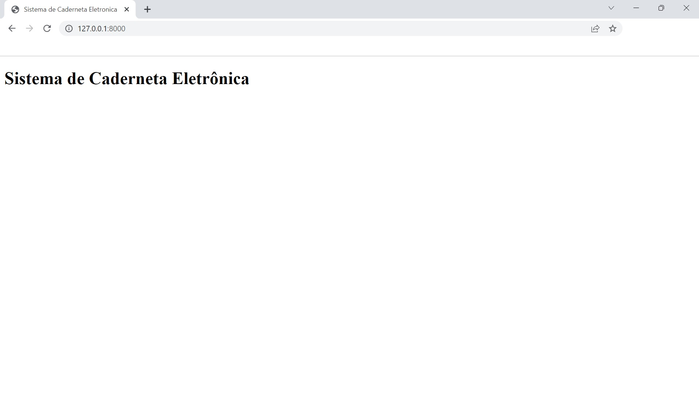
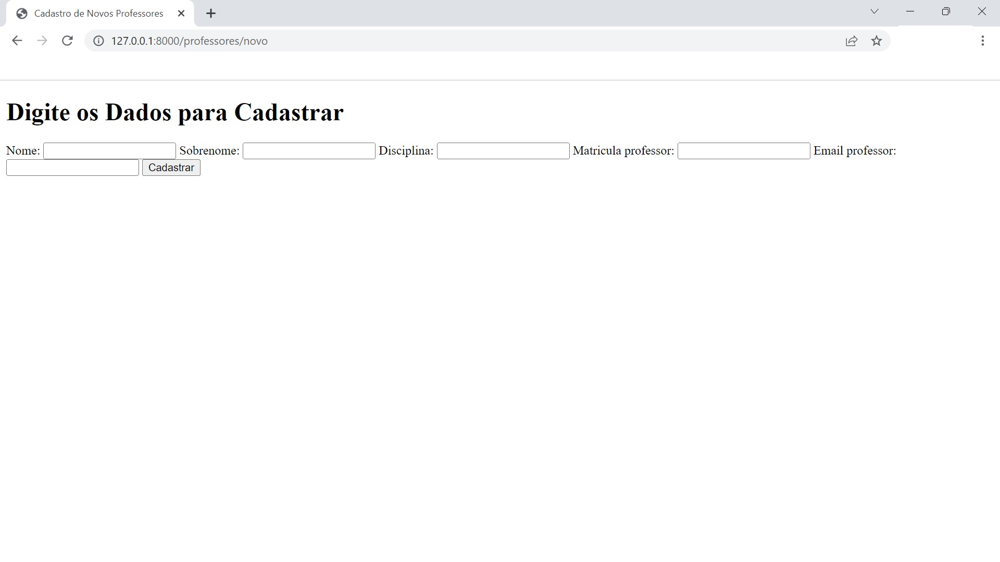
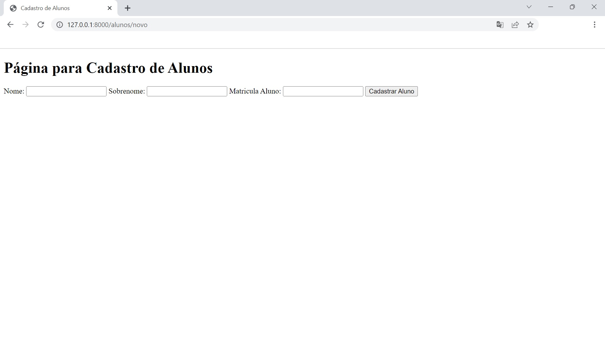

# Projeto Caderneta Eletrônica <h1>

### ** Introdução ** <h3>
O projeto visa auxiliar professores e diretores no lançamento de notas
escolares bem como o acompanhamento do boletim dos alunos.
### ** Instalação ** <h3>
Para instalação e uso do projeto é necessário instalação do framework Django.
### ** Utilização ** <h3>
A utilização do projeto será através de página Web através de login individual
### ** Projeto em Execução ** <h3>
#####$ Home <h5>

##### Cadastro de Professores

##### Cadastro de Alunos

